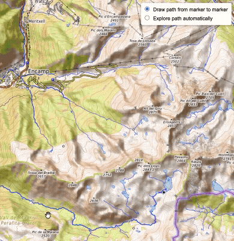

# Uphill Trail Explorer

## Description

Generate paths from trail networks

## Current functionality

1. Create a path by finding the shortest way between coordinates.
2. Find loop trails automatically

## Technical details

- The map is provided by OpenTopoMap and the trails network by Overpass
- DFS and Dikjstra are used to both explore the network and find the shortest path between the two waypoints